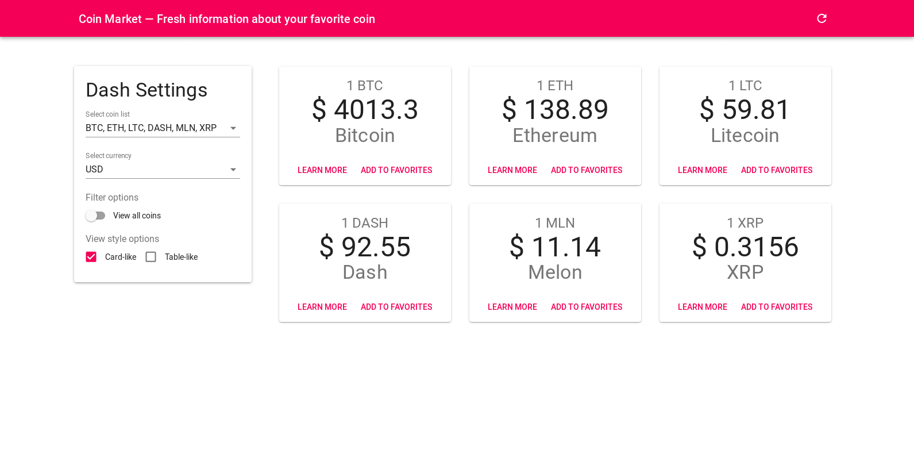

Demo: https://solairedev.space/src/coin-market/

## Functionality

* View real-time coin values
* The ability to select the currency to display the value of coins
* The ability to change style of view (detail/summary) information of coin
* Save/restore user's choose from local storage

## TO-DO

* View detailed information about coins
* Generate a graph on the value of coins
* Create a total graph of the value of your favorite coins
* Import charts into Excel

## Run 

~~~
$ npm i
$ npm start
~~~

## Screenshots

